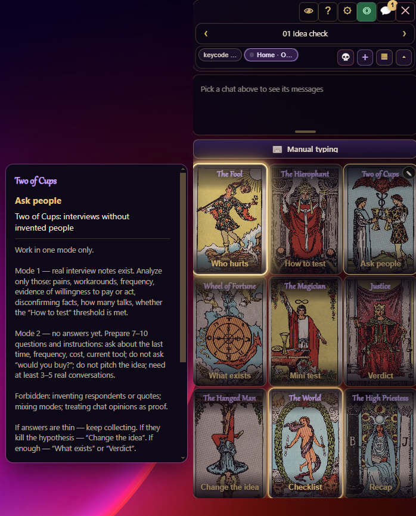
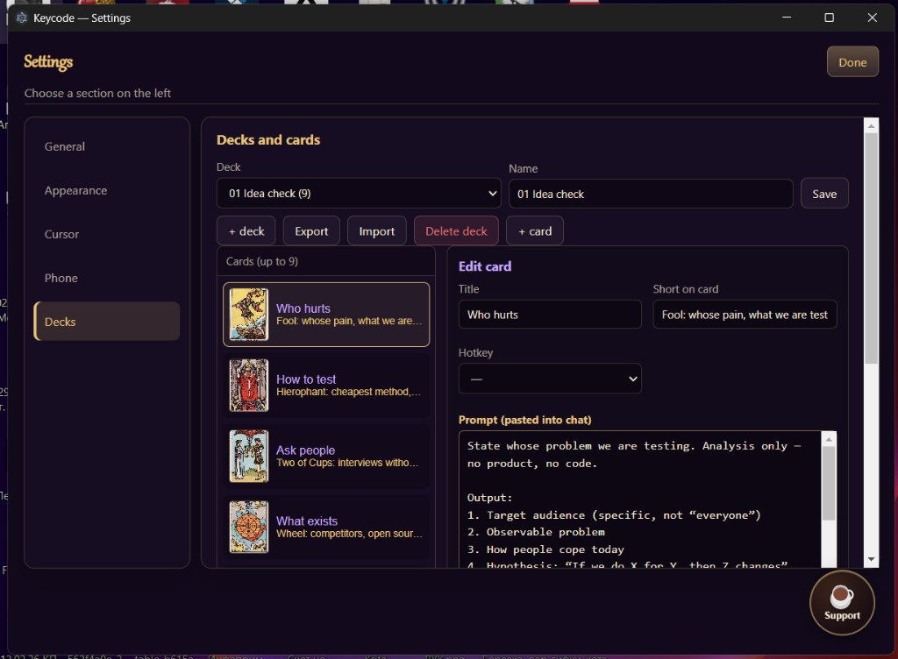
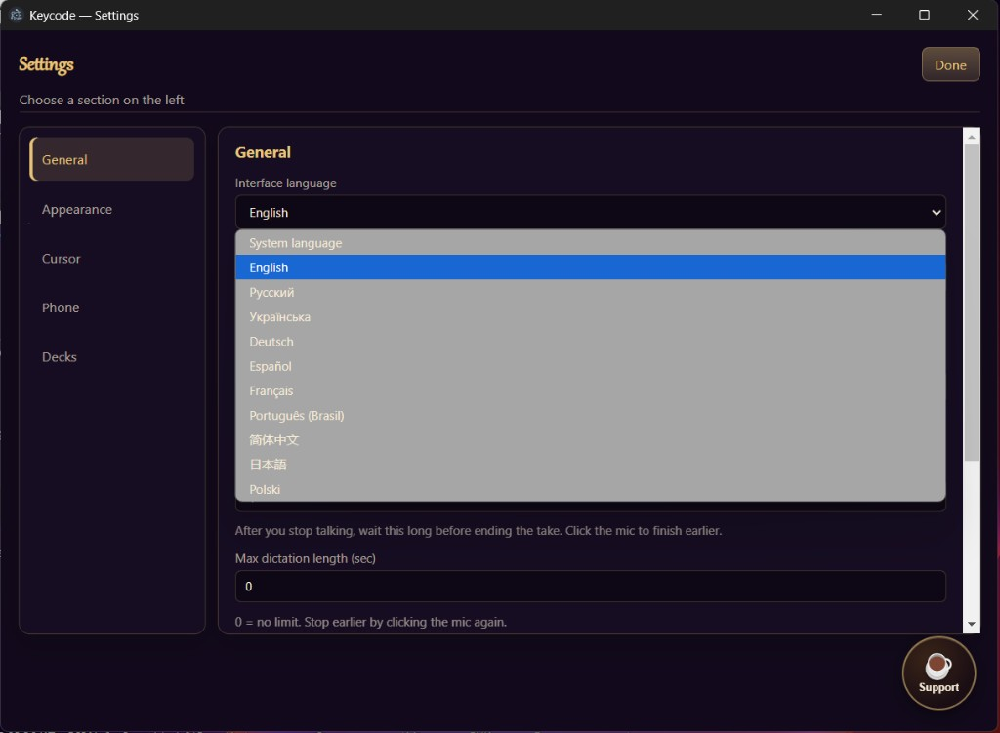
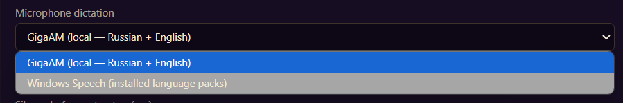

# Keycode — Lazy Coder

Always-on-top **prompt cards** for Windows (up to **9**). One click (or **F1–F8** for hotkeyed cards) pastes a saved prompt into Cursor chats **without stealing focus** — your game or other app stays in front.



| Edit cards and decks | 10 interface languages | Dictation engine |
|----------------------|------------------------|-------------------|
|  |  |  |

**Official builds:** only from [GitHub Releases](https://github.com/DikoeNebo/keycode/releases) on this repository (`DikoeNebo/keycode`). Do not trust re-uploads elsewhere. Verify SHA-256 from the release `SHA256SUMS.txt`.

| | |
|---|---|
| **Download** | [Latest Release](https://github.com/DikoeNebo/keycode/releases/latest) (portable `.exe` or Setup) |
| **License** | [MIT](LICENSE) |
| **Security** | [SECURITY.md](SECURITY.md) |
| **Русский** | см. раздел ниже |

### Quick start (2 minutes)

1. Download `Keycode-*-portable.exe` from Releases and run it.
2. Press **F9** (or the eye button) to show the deck.
3. **◎** or **Settings → Cursor → Always enable (shortcut)** once → close Cursor → open Cursor from the Keycode shortcut (or “Launch Cursor with CDP”).
4. **💬 Chats → + chat** → pick a Cursor chat (or a chip on the destination bar) → click a card (or F1–F8).

Optional: **Phone remote** on the same Wi‑Fi (Settings → enable → scan QR). Anyone on that Wi‑Fi with the link can control the remote — do not share the secret. Phone remote UI languages: English and Russian (desktop UI has 10 locales).

Windows may show **Unknown publisher** (unsigned first builds). Compare the file hash with the release notes:

```powershell
Get-FileHash .\Keycode-0.5.0-portable.exe -Algorithm SHA256
```

---

# Keycode — Lazy Coder (RU)

Прозрачная колода из **до 9 карточек-промптов** поверх всех окон. Клик или **F1–F8** (если у карты есть горячая клавиша) вставляет текст в отмеченные чаты — в том числе в Cursor **без перехвата фокуса** (игра/другое окно остаются активными).

**Официальные сборки:** только [GitHub Releases](https://github.com/DikoeNebo/keycode/releases) репозитория `DikoeNebo/keycode`. Сверяйте SHA-256 из `SHA256SUMS.txt`.

## Запуск (разработка)

Двойной клик по **`start.bat`** (или `npm start`). При первом запуске bat сам установит зависимости.

```bash
npm install
npm test
npm run check
npm start
```

## Сборка

```bash
npm run build          # portable exe
npm run build:installer
npm run build:all      # check + test + portable + NSIS
```

Артефакты: `dist-release/Keycode-<version>-portable.exe`, `dist-release/Keycode-Setup-<version>.exe`.

После сборки: `powershell -File scripts/release-checksums.ps1` → `dist-release/SHA256SUMS.txt` для GitHub Release.

Автопроверка обновлений смотрит релизы в `DikoeNebo/keycode`.

**Важно:** папка `data/locales/` с пятью встроенными колодами (проверка идеи → спецификация → хобби / продакшен → релиз) должна быть в репозитории. Картинки таро — в `assets/tarot/`.

## Как пользоваться

1. Подведите курсор **к краю** — карты выедут (если включено в настройках), или нажмите **F9** / 👁.
2. **◎** или **⚙ → Cursor → Всегда включать фон (ярлык)** один раз → закройте Cursor и откройте новый ярлык. Либо «Запустить Cursor с CDP», если Cursor уже закрыт.
3. **💬 Чаты → + чат** — выбрать чат Cursor; **+ поле** — Блокнот и простые поля. На полосе назначений можно переключить solo-чат или набор.
4. Клик по карте или **F1–F8**.

При первом запуске покажется короткая подсказка.

## Cursor без потери фокуса

В настройках включено **«Не забирать фокус»** (по умолчанию).

1. **⚙ → Cursor в фоне → Всегда включать фон (ярлык)** — на рабочем столе и в меню Пуск появится ярлык Keycode.
2. Закройте Cursor один раз и откройте его **с этого ярлыка**. Дальше порт отладки уже есть при каждом старте.
3. Проверка: **Проверить соединение**. Кнопка «Запустить Cursor для фона» — только если Cursor закрыт / на крайний случай.
4. Cursor слушает только этот ПК: `--remote-debugging-port=9222 --remote-debugging-address=127.0.0.1`.

Любая программа на вашем компьютере с доступом к порту 9222 теоретически может управлять Cursor — закрывайте Cursor с отладкой, когда он не нужен.

## Пульт с телефона (домашняя Wi‑Fi)

Опционально: смотреть загруженный чат Cursor и отправлять карты с телефона в одной Wi‑Fi сети.

1. ПК и телефон в **одной Wi‑Fi**.
2. В Keycode: **⚙ → Пульт с телефона → Включить**.
3. Отсканируйте QR или откройте ссылку вида `http://192.168.x.x:17865/#token=…`.
4. В списке — **все открытые чаты Cursor**; выберите нужный и нажмите карту (карта уходит только в этот чат). Добавлять чат через «+ чат» на ПК для пульта не нужно.

Если телефон не открывает страницу — разрешите Keycode (или порт) в брандмауэре Windows для **частной** сети. У кого в этой Wi‑Fi есть ссылка с секретом — может управлять пультом; секрет не показывайте чужим.

Доступ из интернета / Funnel не открываем. Режим Tailscale Serve — позже (в настройках свёрнут как «вне дома»). Нужен Cursor с отладкой для фона (CDP).

## Возможности

- Пять встроенных колод по фазам: **проверка идеи → спецификация → работа (хобби / продакшен) → релиз** (по 9 карт; UI на 10 языках)
- Несколько целей сразу или solo-чат; Enter после вставки — вкл/выкл
- Редактор карт и колод, экспорт / импорт JSON (с проверкой)
- Автопроверка обновлений (GitHub Releases), когда релиз опубликован
- Опциональный веб-пульт с телефона (та же Wi‑Fi + секрет; интерфейс пульта — EN/RU)

Данные: `%APPDATA%/keycode-lazy-coder/keycode-data/`  
Логи: `%APPDATA%/keycode-lazy-coder/keycode-data/logs/` (без текстов промптов)

## Безопасность Windows / SmartScreen

Первые публичные сборки могут быть **без цифровой подписи**. Windows покажет «Неизвестный издатель» — это ожидаемо для unsigned open-source. Сверяйте SHA-256 из GitHub Release с файлом:

```powershell
Get-FileHash .\Keycode-0.5.0-portable.exe -Algorithm SHA256
```

## Лицензия

MIT. Картинки таро: см. `assets/tarot/ATTRIBUTION.txt`.
